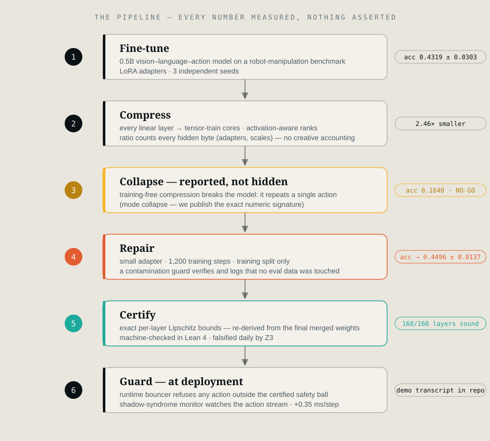

<div align="center">


# Certified compression for robot brains.

**Shrink a vision–language–action model 2.46× — keep its accuracy — and ship it with a math proof attached.**

[](https://github.com/ZakLr/qicert/actions/workflows/ci.yml)
[](lean/)
[](results/EXPERIMENT-LOG.md)
[](LICENSE)

📖 **For a beautiful read of our solution — with interactive demos, diagrams, and the full paper — visit [qicert.vercel.app](https://qicert.vercel.app/).**
[Website](https://qicert.vercel.app/) · [Documentation](https://qicert.vercel.app/docs/) · [Technical report (PDF)](https://qicert.vercel.app/papers/technical-report-v2.pdf) · [Team — AIQ Community](https://www.aiqcommunity.org/)

</div>

---

> [!NOTE]
> **In one sentence.** We compressed a vision–language–action model — the AI that turns a camera frame and a spoken instruction into robot actions — to **2.46× smaller**, and it still acts like the original. Unlike standard compression, every layer comes with an **exact, verifiable math bound** on how much its behavior can change, and a runtime guard that refuses any action the bound doesn't cover.

**Why it matters:** compression usually ships with a shrug — "we tested it, seems fine." That's a guess, not a guarantee, and nobody puts guesses on robots. `qicert` replaces the shrug with a certificate: a number computed from the deployed weights themselves, machine-checked in **Lean 4**, falsified daily by a Z3 test-suite, enforced at runtime.

---

## 📊 The results, honestly

Pre-registered gate: **compression ≥ 2.0× AND accuracy ≥ 0.3968** (within 0.05 of the uncompressed model). Set *before* the experiments ran. Three independent seeds. Full evaluation protocol: 6,496 batches / 114,497 tokens.

| Method | Size | Accuracy | Exact per-layer certificates | Verdict |
|---|---|---|---|---|
| Fine-tuned baseline (uncompressed) | 1.00× | 0.4319 ± 0.0303 *(3 seeds)* | — | reference |
| INT8 quantization, calibrated | 2.00× | 0.4466 (Δ −0.0001) | ❌ structurally impossible | strong at its ceiling |
| TT-SVD, training-free | 2.54× | 0.1640 | ✅ 168/168 | **NO-GO** — collapses |
| **TT-SVD + trained repair (ours)** | **2.46×**¹ | **0.4496 ± 0.0137** *(3 seeds)* | ✅ **168/168** | **GO — 3 of 3 seeds** |

<sup>¹ "Honest ratio": the repair adapter's bytes are counted, not hidden.</sup>

**Read that third row again.** Training-free compression didn't gracefully degrade — it *collapsed* (the model started repeating one action; we show the exact numeric signature). We report it as a first-class result, diagnosed the mechanism, and fixed it with 1,200 steps of repair training on training data only. The arc — *set a bar → fail it honestly → diagnose → fix → pass* — is the paper.

**Where's INT8's line?** Calibration makes INT8 nearly lossless **at 2.0×** — that's its structural ceiling (8 bits = 4× on weights alone; with scales/zero-points, ~2×). Past 2×, INT8 has nowhere to go. And at *any* ratio, quantization error is data-dependent and unfactorizable — **it cannot state a bound like ours, at any size.** We don't beat INT8; we operate where it can't, with a property it can't have.

---

## 🧭 Never seen these words before?

| Term | Plain meaning |
|---|---|
| **VLA** | Vision-Language-Action model — the AI that turns a camera frame + instruction into robot actions |
| **GO / NO-GO** | A pre-registered pass/fail bar, written down *before* the experiment ran. No moving goalposts. |
| **TT (tensor-train)** | A way of storing a big weight matrix as a chain of small pieces ("cores") — the compression itself |
| **Certificate** | A proven ceiling: *"this layer can magnify any input distortion by at most L, ever."* Exact, not statistical |
| **Guard** | Runtime bouncer: refuses any action that could exceed the certified safety ball |
| **Sound** | The certificate's math checks out on layer *k* of 168 |
| **Honest ratio** | Compression counting *every* hidden byte (adapters, scales) — no creative accounting |
| **Seeds** | Independent reruns with different random starts. 3/3 = it wasn't luck |

---

## 🧠 Where Lean 4 comes in

Most "safe AI" projects test their claims. **We formalize them.** [Lean 4](https://lean-lang.org/) is a proof assistant — the same class of tool mathematicians use to verify theorems that no human can check by hand. Our core safety property is written as a theorem and verified by Lean's kernel with **zero `sorry`** (Lean's marker for an unfinished proof):

- **`prod_le_prod_of_pointwise`** — the composition theorem: the certified bound of a chain of layers is the product of the per-layer bounds. This is the mathematical spine of every certificate we ship.
- **`guard_sound`** — the runtime guard never accepts an action outside the certified safety ball.
- **`guard_complete`** — and it never rejects a safe action.

Lean doesn't trust our code, our tests, or us — it checks the mathematics itself, mechanically. Alongside it: **84 pytest tests including Z3, an SMT solver actively trying to falsify the guard** (it finds no counterexample), and a runtime guard demo transcript. Three independent checkers, three formalisms, one conclusion.

```bash
cd lean && lake build   # verifies every theorem above — no computer algebra, pure logic
```

---

## 🔧 How it works

<div align="center">

</div>

1. **Fine-tune** a 0.5B VLA on a robot-manipulation benchmark (LoRA, 3 seeds).
2. **Compress** every linear layer into tensor-train cores with activation-aware ranks.
3. **Collapse** — training-free compression breaks the model. We show *why* (mode collapse, with the numeric signature) instead of hiding it.
4. **Repair** — a small adapter, 1,200 training steps, *training split only* (a contamination guard verifies and logs this).
5. **Certify** — exact per-layer Lipschitz bounds, re-derived from the final merged weights (not the pre-repair ones).
6. **Guard** — at runtime, refuse any action outside the certified ball; a monitor watches the action stream for degenerate behavior.

### The one inequality everything rests on

```
‖W‖₂ ≤ ∏ₖ ‖G⁽ᵏ⁾‖₃      — the spectral norm of a tensor-train matrix
                         is the product of its core norms.
```

The bound is **exact** (no looser-than-necessary hand-waving), computable **from the compressed cores alone** (never materialize the big matrix), holds **after repair** (re-derive from merged weights) — and its composition is **machine-checked in Lean 4**. This is what INT8 cannot state: quantization error has no such factorization.

Plus the shadow-syndrome monitor: **0.0000 false-alarm rate** over 4,000 null trials, **1.000** bit-flip detection over 500 injections, **0.35 ms** added latency per step.

---

## ⚡ Quickstart

```bash
git clone https://github.com/ZakLr/qicert && cd qicert
pip install -e .          # pinned deps; CUDA optional — CPU runs the smoke suite

python -m qicert.bench.all --rows=smoke     # ~5 min, no GPU: full correctness check
python -m qicert.bench.all                  # full suite — every table in the report
```

Verified in CI: fresh venv → install → smoke passes, zero manual steps.

<details>
<summary><b>Reproducing the headline result</b> (needs a ~8 GB GPU)</summary>

```bash
# 1. Fine-tune the baseline (one seed ≈ 30 min on an RTX 5060)
python scripts/run_remaining_experiments.py --only n1v2

# 2. Compress → repair → confirm (the N9 pipeline, one seed ≈ 1.5 h)
python scripts/run_remaining_experiments.py --only n9-repair,n9-confirm

# Everything is sequential + resumable; completed stages auto-skip.
```

Full per-stage commands, expected runtimes, and artifact map: [`results/EXPERIMENT-LOG.md`](results/EXPERIMENT-LOG.md).

</details>

---

## 📁 Repository map

```
python/qicert/      the library: compress · certify · guard · safety · monitor · compiler
bench/              one module per report table (--rows contract; smoke set runs in CI)
lean/               machine-checked proofs — lake build clean, zero sorry
cpp/                Phase-2 C++ kernel skeleton (compiles + self-tests; no perf claims)
tests/              84 tests incl. Z3 falsification of the guard logic
results/            every number in the report, traceable to a run dir + ledger row
docs/               technical report (PDF) · concept proposal · resource declaration
brand/              logo + banner source (SVG) and exports (PNG)
```

**Provenance rule:** every number in the README and the report resolves to a run directory (`run.json` + `config.json`) and a row in `results/ledger.csv`. Nothing is asserted from memory.

<details>
<summary><b>Honest limitations</b> — we'd rather list them than have you find them</summary>

- **One backbone, one benchmark.** 0.5B VLA on LIBERO-spatial. Cross-model generality is Phase 2 — the 1.5B scale probe is designed and queued.
- **Per-layer exact ≠ end-to-end certified.** Chaining 168 exact bounds multiplies into a vacuous number — true of *any* 168-layer model, including the uncompressed one. We ship per-layer exactness + the runtime guard, and we say so.
- **Repair is a trained component.** 1,200 LoRA steps, cost charged to our arm under matched-budget rules, contamination-guarded.
- **2-of-3 seeds beat their own baseline** (third holds parity). Mean ± std reported; no seed dropped silently.
- **No quantum-hardware claims.** The QI component is the tensor-network structure and the quantum-inspired monitor; the IQAE estimator is scored via a documented NumPy amplification simulation (the estimator sees only measurement counts, exactly as it would on hardware). CUDA-Q is prepared in the container image for Phase-2, not used for any reported number. Nothing here runs on, or claims speedup from, quantum hardware.

</details>

---

## 📄 Licensing — what applies to what

**The code in this repository is Apache 2.0** (see [LICENSE](LICENSE)). Third-party building blocks carry their own licenses, listed here so you don't have to dig:

| Component | Role | License | Conflict with Apache-2.0? |
|---|---|---|---|
| `qicert` code, Lean proofs, docs | ours | **Apache 2.0** | — |
| MiniVLA checkpoint + Prismatic backbone (`Stanford-ILIAD`, HF) | base model we fine-tune & compress | MIT | none |
| Qwen2.5-0.5B (`Qwen/Qwen2.5-0.5B`, HF) | LLM backbone | Apache 2.0 | none |
| LIBERO benchmark (Lifelong-Robot-Learning) | training/eval episodes | MIT | none |
| timm DINOv2 ViT-L weights (`vit_large_patch14_reg4_dinov2.lvd142m`) | vision tower inside the backbone | **CC-BY-NC 4.0** ⚠️ | **non-commercial** |
| SigLIP ViT-SO400M weights (timm/OpenCLIP) | second vision tower | Apache 2.0 | none |
| PyTorch, Transformers, PEFT, NumPy/SciPy | training stack | BSD / Apache 2.0 / MIT | none |
| tntorch, quimb, PennyLane | optional tensor-network/QML reference paths (not required — our kernels are in-repo NumPy/SciPy) | MIT / Apache 2.0 | not used for any Phase-1 number |
| NVIDIA CUDA-Q | prepared in container for Phase-2 hardware-pathway work | Apache 2.0 | not used for any Phase-1 number |
| Z3 (SMT solver), Lean 4 + Batteries | verification toolchain | MIT | none |

> [!WARNING]
> **The one thing to know:** the DINOv2 vision tower inside the base model is **CC-BY-NC 4.0** — non-commercial. Everything *we* produced (compression machinery, certificates, guard, proofs) is genuinely Apache 2.0, but any **commercial deployment of the full fine-tuned model inherits that NC restriction from the vision tower**. This is a property of the upstream checkpoint, not of our method — the method is backbone-agnostic and was also validated against Apache-2.0 components (SigLIP, Qwen). Research and evaluation use: fully clear.

The brand assets in [`brand/`](brand/) are ours — reuse with attribution.

---

## 🗺️ Phase 2 roadmap

| Lever | Status |
|---|---|
| Scale probe (1.5B backbone — does bigger = more compressible?) | designed, queued |
| C++ contraction kernels (TT matvec ≤1.5× dense) | skeleton compiles, gates set |
| SOS local certificates (tighter per-scenario boxes) | scoped |
| SSM / linear-attention backbone | scoped — protocol-isolated |
| Cross-model replication | the whole point of Phase 2 |

---

## 👥 Team

Built by **[AIQ Community](https://www.aiqcommunity.org/)** for The Quantum Insider's Global Quantum + AI Challenge (Volkswagen track, robotics) — Phase 1, September 2026.

- 📫 **Zakaria** — [zakaria@aiqcommunity.org](mailto:zakaria@aiqcommunity.org)
- 🌐 [aiqcommunity.org](https://www.aiqcommunity.org/) · [Project website](https://qicert.vercel.app/) · [Docs](https://qicert.vercel.app/docs/)

<div align="center">

<br/>
<sub><i>a smaller model, with a proof.</i></sub>
</div>
